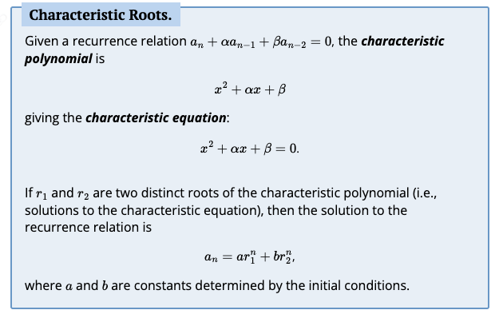

- Investigate!
    
    1. $1, 2, 4, 8, 16$, so clearly the the numbers is double the previous. This is just the powers of two, $a_n=2^n$

    2. $1, 3, 9, 27$ So now it triples every time. $a_n=3^n$

    3. $2, 5, 13, 35, 97$ i don't see a pattern.

- Example 2.4.1

    1. diffs are $4, 12, 36$, multiplying by 3 everytime. $a_n=3a_{n-1}+2$ with $a_0=1$

- Example 2.4.2

    1. They both produce the sequence $3, 5, 9, ...$. Supposedly you can plug in and simplify, but i don't understand step two
    $$2a_{n-1}-1=2(2^{n-1}+1)-1$$
    $$=2^n+2-1$$
    $$=2^n+1$$
    $$a_n$$

- Telescoping is when many terms in a large sum cancel out $$(2-1) + (3-2) + (4-3) + ... + (100-99) + (101-100) = -1 + 101$$

- Example 2.4.3

    1. first few terms are $4, 5, 7, 10, 14, 19$. I did not understand this, [solution here is a good explanation](https://discrete.openmathbooks.org/dmoi3/sec_recurrence.html#:~:text=%F0%9F%94%97-,Example%202.4.3.,-Solve%20the%20recurrence)

- Above example solving method only works when recurrence relations are written like $a_n=a_n{n-1}+f(n)$ and the closed formula for the sum (in the above it is $\dfrac{n(n+1)}{2}$ because the difference between terms is $1,2,3,...$)

- Telescoping will not work on all recurrence relations, like $a_n=3a_{n-1}+2$. Instead iterate

- Iteration is when you plug in (iterate) terms until have $a_n$.

- Example 2.4.4

    1. So we iterate by plugging values starting at $n=1$
    $$a_1=a_0+1 $$
    $$a_2=(a_0+1)+2 $$
    $$a_3=((a_0+1)+2)+3 $$
    by now you may see this pattern
    $$a_n=((a_0+1)+...+n-1)+n$$ 
    and we know $a_0=4$, and that summing natural numbers up to $n$ is $\dfrac{n(n+1)}{2}$, so we really just have $$a_n=4+\dfrac{n(n+1)}{2}$$

- Example 2.4.5

    1. Well ill try iteration
    $$a_1=3a_0+2$$
    $$a_2=3(3a_0+2)+2$$
    $$a_3=3(3(3a_0+2)+2)+2$$
    i don't see a pattern so im going to simplify 
    $$a_1=3a_0+2$$
    $$a_2=3^2a_0+2*3+2$$
    $$a_3=3^3a_0+2*3^2+2*3+2$$
    a pattern is visible
    $$a_n=3^na_0+2*3^{n-1}+...+2*3+2$$
   Because $a_0=1$ we have $3^n$ and then just a sum of $2+2*3+2*3^2+...+2*3*n-1$. Use [this](https://discrete.openmathbooks.org/dmoi3/sec_seq-arithgeom.html#:~:text=%F0%9F%94%97-,Example%202.2.7.,-What%20is) to find that it is equal to $3n-1$. Formula is then just $3_n+3_n-1$ or $2*3_n-1$

- Iteration is sometimes too complicated, like when the recurrence relation involves the two previous terms. 

    - So take $a_n=a_{n-1}+6a_{n-2}$. We want to a find a function which satisfies $a_n-a_{n-1}-6a_{n-2}=0$. Iteration is too complex, but we can recognize that we would multiply the previous iteration by 6, so the closed formula would involve 6 multiplied some number of times. So we can reasonably guess the solution is geometric. Maybe even like $r^n$ with $r$ being some now unknown constant.

    - So lets plug in $r^n$. We get $r^n-r^{n-1}-6^{n-2}=0$, which can be factored to $r^{n-2}(r^2-r-6)=0$ and $r=-2, r=3, r=0$, the latter of which is useless. So we know that for any $a, b$ (initial conditions basically), $a_n=a(-2)^n+b3^n$.

    

- Example 2.4.6

    - Ok So we have $a_n-7a_{n-1}+10a_{n-2}=0$. We can see here that we would be multiplying previous terms by -10 and 7, so we can assume its geometric, using some $r^n$. Plugging in $r^n$ we get $r^n-7r^{n-1}+10r^{n-2}=0$, which can be factored into $r^{n-2}(r^2-7r+10)$. We can see that $r=5,r=2,r=0$. So we can deduce that the formula is $a_n=a2^n+b5^n$. So we can plug in the initial conditions $$2=a2^0+b5^0=a+b$$ $$3=a2^1+b5^1=2a+5b$$. This is a system of equations where $a=2-b$, so $3=2(2-b)+5b$, $3=4-2b+5b$, $-1=3b$, $-\dfrac{1}{3}=b$. $2=a-\dfrac{1}{3}$, $\dfrac{7}{3}=a$. So finally, the formula is $a_n=\dfrac{7}{3}2^n-\dfrac{1}{3}5^n$

- When you are using the characteristic root technique and there is only one root (r) then the solution is $a_n=ar^n+bnr$

- Example 2.4.7

    - Were gonna end up with $r^2-6r+9$, which factors to $r=3, r=3, r=0$. Our formula is $a_n=a3^n+bn3^n$ We can make plug this in to find $1=a3^0+b(0)3^0$, so $1=a$. Now we can do $$4=3^1+3b$$ $$1=3b$$ $$b=\dfrac{1}{3}$$. So the formula is $a_n=3^n+\dfrac{1}{3}n3^n$

- characteristic root technique only works when the recurrence relation is the linear combination of some previous terms. No additional constants can be present.