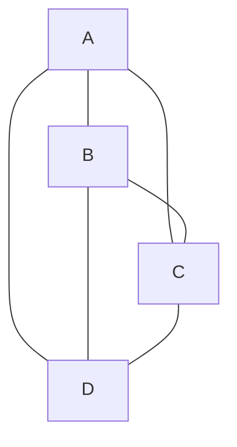
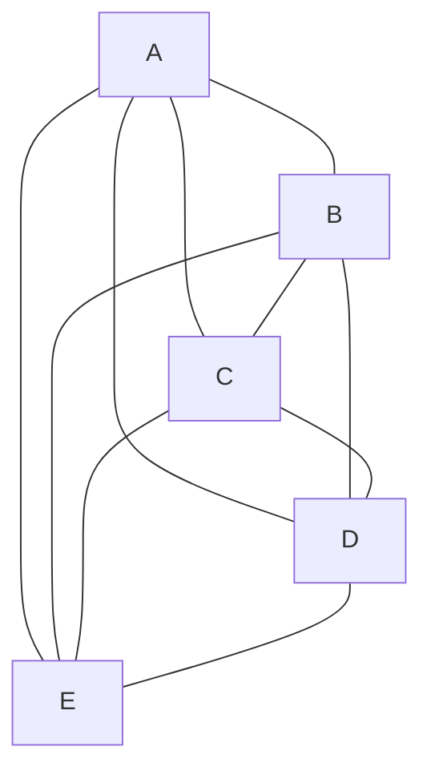

# Which of the following graphs contain an Euler path? Which contain an Euler circuit?
## a. $K_4$

note that every vertex has an odd degree, so it is not a euler path.

## b. $k_5$

Every vertex has an even degree (4) so it has a euler circuit and thus a euler path.

## c. $k_{5,7}$
Im not gonna model this becuase it would be insane. But we can see that all vertices in first set are connected to 7 vertices and all vertices in the second set are connected to 5 vertices, meaning all vertices have an odd degree. This means there is neither a euler path or circuit.

## d. $k_{2,7}$
Once again not gonna model it, but we can see that all vertices in the first set have an odd degree and all vertices in the second set have an even degree. So becuase we have $\leq$ 2 vertices with an odd degree we have a euler path and not a circuit

## e. $C_7$
This is clearly a euler cicuit, it is a circuit!

## f. $p_7$

Its just a path. Only two vertices have an odd degree (the first and the last ones in the path), so it is a euler path but not a euler circuit.

