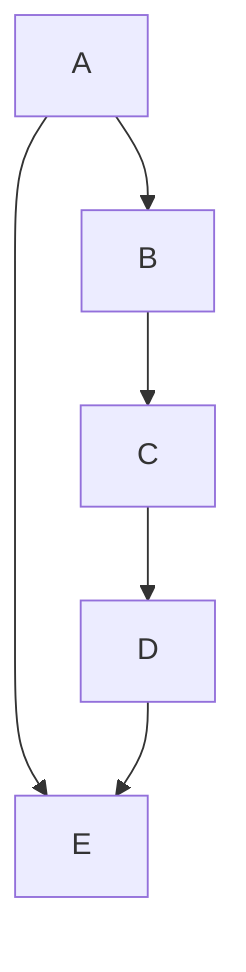
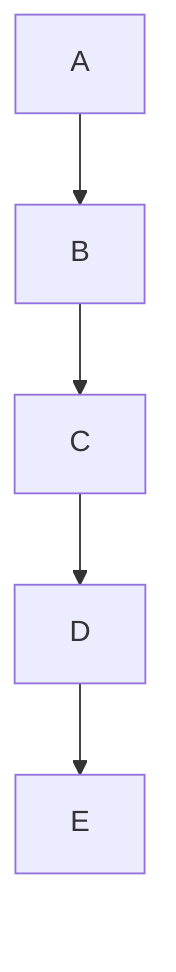
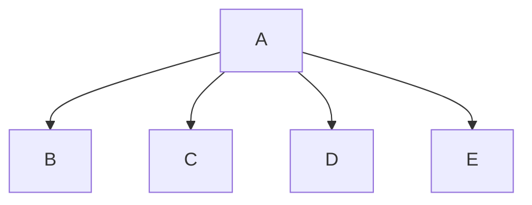
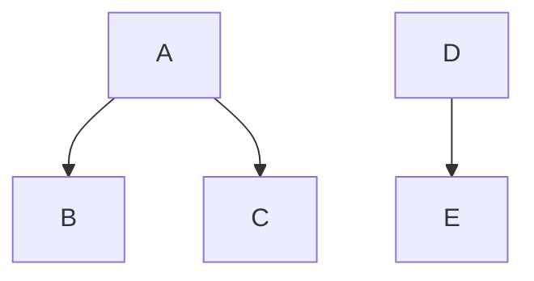

## Which of the following graphs are trees?
a. $G = (V, E)$ with $V = \{a, b, c, d, e\}$ and $E = \{\{a, b\}, \{a,e\}, \{b, c\}, \{c,d\}, \{d,e\} \}$

    no it has an obvious cycle

b. What if $E = \{\{a, b\}, \{b, c\}, \{c,d\}, \{d,e\}\}$?

    yes, there are no cycle. It is also a path, and all paths are trees

c. What if $E = \{\{a, b\}, \{a, c\}, \{a,d\}, \{a,e\}\}$?

    yes, there are no cycles and it is a star. All stars are trees

d. What if $E = \{\{a, b\}, \{a, c\}, \{d,e\}\}$?

There are not enough edges (should be $v-1$) and it should be connected, so it is not a tree
